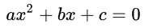

# Algorithm  / langage C
Exercices Algoritmiques / Langage C

## Exercice 1 - Équation linéaire
Écrire un algorithme qui résolu l'équation linéaire étant donné les paramétres **(Y , A , B)** selon l'équation suvante : **Y = Ax + B** .

## Exercice 2 - Équation du second degré 
Écrire un algorithme qui calcule l'ensemble des solutions d'une équation du second degré :  . 

## Exercice 3 - Fibonacci
Écrire un algorithme qui résolu le probléme de la suite fibonacci :  . 

## Exercice 4 - La factorielle
Écrire un algorithme qui calcule la factorielle d'un nombre n entier naturel :  . 

## Exercice 5 - Loi d'Ohm
Écrire un algorithme qui calcule sois **U** ou **R** ou **I** selon les données obtenu :   .

